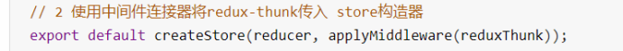

### redux 基本工作流程
- 1、页面视图UI通过各种事件触发，然后dispatch一个action给store，
  - 这个action包含了type类型和payload数据
  
- 2、store把这个action交给reducer，
  - reducer根据action的type来判断要对状态执行哪种操作，根据payload来修改数据

- 3、reducer对state进行深复制然后返回新的state，sotre就会更新，更新了，页面视图就会更新

### 组件使用redux的数据
  - 从react-redux中引入connect
  
  - 定义函数mapStateToProps(store)，把store中的数据映射进来
  ```
  function mapStateToProps(store) {
    return {
      msg: store.study.msg,
    }
  }
  ```
  - 定义函数mapActionsToProps(dispatch)，用dispatch来派发action
  ```
  function mapActionsToProps(dispatch) {
    return {
        changeMsg: payload=>dispatch(changeMsgAction(payload)),
    }
  }
  ```
  - 用高阶函数connect后抛出组件
    - export default connect(mapStateToProps, mapActionsToProps)(TestRedux)


作用：用来管理状态的。三大原则：单一的数据源，state是指读的，使用纯函数来进行修改。

当组件需要改变Store数据的时候。需要创建一个Action,然后通过 dispatch(action) 传递给Store，然后Store把Action转发给Reducers. Reducers会拿到previousState(以前的state数据) 和action。然后将 previousState和action进行结合做新的数据(store)修改。然后生成一个 新的数据传递给Store 。Store通过触发subscribe()这个方法来调用函数 执行setState使得view的视图发生改变


1. ##### 如何处理异步action

   ##### 答：引入applyMiddleware连接器，还要引入redux-thunk，使用连接器把redux-thunk传到仓库中:

