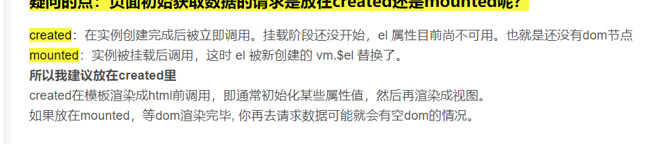

### v-model 响应式原理 data作用 数组对象的某些操作不具有响应
- vue的数据双向绑定可以实现响应式的效果：数据变，视图变，视图变，数据也跟着变

- 在ES5中，Object有一个静态方法：defineproperty；通过这个函数可以监听到set和get事件

- data劫持：当vue实例或组件初始化时，就会通过Object.defineProperty方法对数据进行劫持，为data中的数据添加setter和getter方法；在读取数据时触发getter方法，修改数据时触发setter方法

### 数据变，视图不一定变
- data中的数据也就是只有在初始化时才会被defineProperty劫持：如果这个数据在初始化的时候并不在data中，而是组件挂载后才新增的，那么这数据就不会被defineProperty劫持到，也就不具有响应式的特点，
- 
- 数组的两种变动不能被VUE监测到，不具有响应式：
  - 当你利用索引直接设置一个数组项时，例如：arr[index] = newValue
    - 解决1：使用 Vue.set(arr, index, newValue)
    - 解决2：使用数组splice删除旧值，添加新值的方式 arr.splice(index, 1, newValue)
  - 当你修改数组的长度时，例如：arr.length = newLength
    - 解决：用splice来修改 arr.splice(newLength)
- 对象属性的添加或删除不能被VUE监测到，不具有响应式：
  - 原因：对于已经创建的实例，Vue 不允许动态添加根级别的响应式属性
  - 添加一个属性的解决：使用 Vue.set(object, key, newValue)
  - 添加多个属性的解决：使用 Object.assign =>按顺序传入空对象，原对象，新key-value
    - obj = Object.assign( {}, obj ,{ key1:value1,key2:vlaue2,...} )

### data 为什么要return数据
- data是一个函数时，每个组件实例都有自己的作用域，每个实例相互独立,不会相互影响，也叫闭包！！